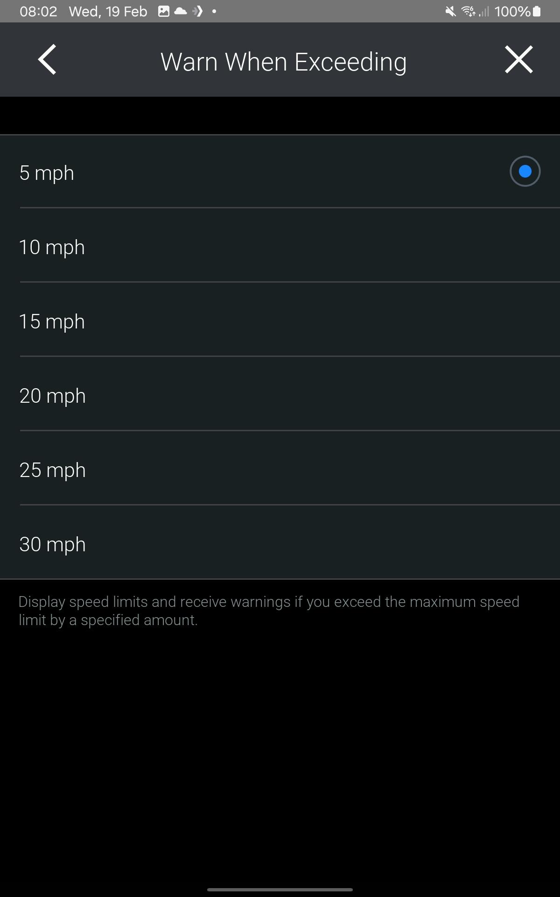
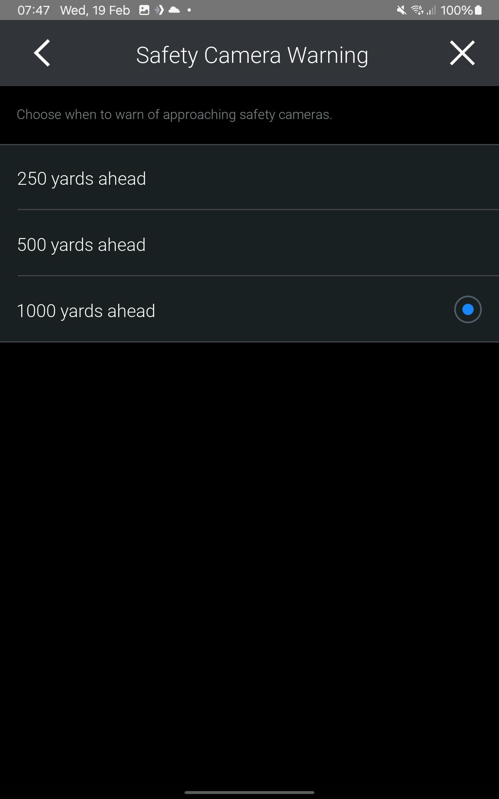
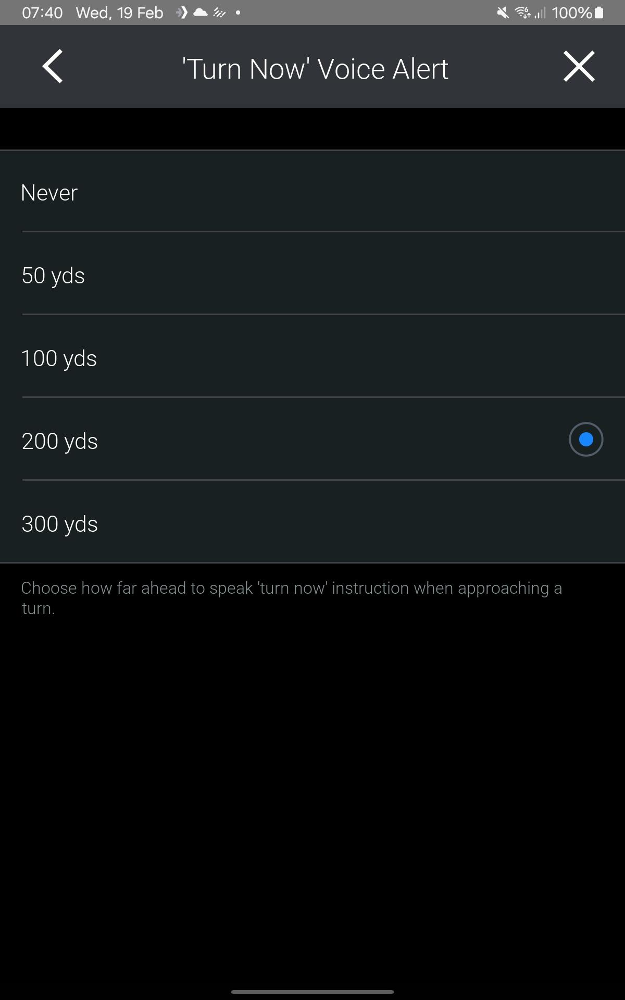

# CoPilot Guidance Configuration

## Config Keys

```
	public interface Guidance{
		//config
		public static final String 	CONFIG_SPEED_ALERT_ENABLED 										= "copilot.guidance.speed.alert.enabled";
		public static final String 	CONFIG_SPEED_ALERT_DISPLAY_ENABLED 								= "copilot.guidance.speed.alert.display.enabled";
		public static final String 	CONFIG_SPEED_ALERT_AUDIO_ENABLED 								= "copilot.guidance.speed.alert.audio.enabled";
		public static final String 	CONFIG_SPEED_ALERT_THRESHOLD 									= "copilot.guidance.speed.alert.threshold";

		public static final String 	CONFIG_SAFETY_CAMERA_ALERT_ENABLED 								= "copilot.guidance.safety.camera.alert.enabled";
		public static final String 	CONFIG_SAFETY_CAMERA_ALERT_RANGE 								= "copilot.guidance.safety.camera.alert.range";

		public static final String 	CONFIG_TURN_NOW_DISTANCE 										= "copilot.guidance.turn.now.distance";


		//default
		public static final boolean DEFAULT_SPEED_ALERT_ENABLED 									= true;
		public static final boolean DEFAULT_SPEED_ALERT_DISPLAY_ENABLED 							= true;
		public static final boolean DEFAULT_SPEED_ALERT_AUDIO_ENABLED 								= false;
		public static final int 	DEFAULT_SPEED_ALERT_THRESHOLD 									= 0;

		public static final boolean	DEFAULT_SAFETY_CAMERA_ALERT_ENABLED 							= false;
		public static final int 	DEFAULT_SAFETY_CAMERA_ALERT_RANGE 								= 100;

		public static final int 	DEFAULT_TURN_NOW_DISTANCE 										= 50;
	}
```


## Notes On Speed Limit Threshold
[Guidance Settings - Get Safety Camera Alert Range](https://developer.trimblemaps.com/copilot-navigation/cpik-libraries/native-and-dot-net/api-functions/guidancemgr/settings/#guidancesettingsgetsafetycameraalertrange)
> **`copilot.guidance.speedAlert.threshold`**


| Threshold Value | Alert Condition                           |
|-----------------|--------------------------------------------|
| 0               | Alerts shown when speed greater than 5mph  |
| 1               | Alerts shown when speed greater than 10mph |
| 2               | Alerts shown when speed greater than 15mph |
| 3               | Alerts shown when speed greater than 20mph |
| 4               | Alerts shown when speed greater than 25mph |
| 5               | Alerts shown when speed greater than 25mph |


---

## Notes On Speed Camera Alert Range
[Guidance Settings - Get Speed Limit Threshold](https://developer.trimblemaps.com/copilot-navigation/cpik-libraries/native-and-dot-net/api-functions/guidancemgr/settings/#guidancesettingsgetspeedlimitthreshold)
> **`copilot.guidance.safety.camera.alert.range`**

| Range Value     | Alert Effect                                      |
|-----------------|---------------------------------------------------|
| 0               | Alerts driver when camera is within short range   |
| 1               | Alerts driver when camera is within medium range  |
| 2               | Alerts driver when camera is within long range    |



---


## Notes On `Turn Now Distance`

<p> This is an integer value which represents a geographic ground distance in imperial yards.</p>



